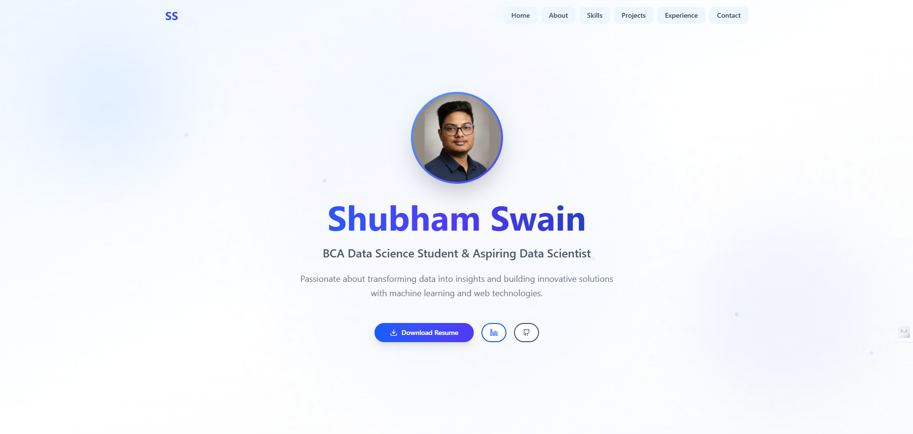

# Portfolio Website



## Overview

This is the personal portfolio website of **Shubham Swain**, a BCA Data Science student.
It showcases projects, skills, and contact information, and includes interactive animations and modern UI elements using **React**, **Tailwind CSS**, and **Framer Motion**.

## Features

* Fully responsive design
* Smooth animations with Framer Motion
* Contact form with EmailJS integration
* Downloadable resume
* Links to LinkedIn and GitHub
* Floating background effects and interactive elements
* Dark/Light theme support (if implemented)

## Tech Stack

* **Frontend:** React, TypeScript, Tailwind CSS
* **Animations:** Framer Motion
* **Forms:** EmailJS
* **Icons:** Lucide React
* **Deployment:** Vercel

## Installation

Clone the repository:

```bash
git clone https://github.com/Shubham1489/portfolio.git
cd portfolio
```

Install dependencies:

```bash
npm install
```

Start the development server:

```bash
npm run dev
```

Build for production:

```bash
npm run build
```

## Usage

* Navigate to the home page to see the hero section with animated profile photo and intro.
* Scroll down to explore projects, skills, and contact form.
* Use the **Download Resume** button to get the PDF resume.
* Connect via **LinkedIn** or **GitHub** using the provided buttons.

## Deployment

This project is deployed on **Vercel**:
👉 [Live Portfolio Link](https://shubham-portfolio-sigma-two.vercel.app/)

## Contributing

Contributions are welcome!
Please open an issue or submit a pull request for improvements, bug fixes, or new features.

---

© 2025 Shubham Swain. All rights reserved.
